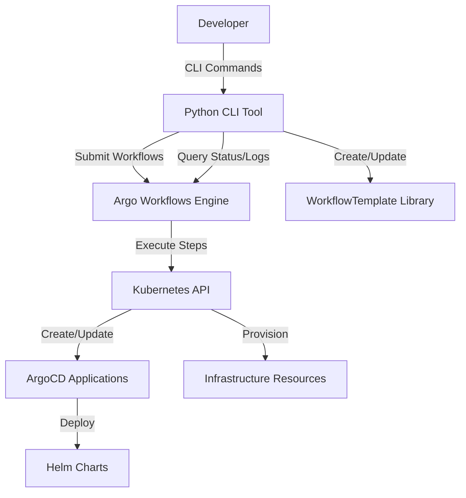

# Design Document

## Overview

This system provides infrastructure automation using Argo Workflows to orchestrate the creation and management of ArgoCD Applications and ApplicationSets. The architecture consists of three main components:

1. **Python CLI Tool**: User-facing command-line interface for submitting and managing workflows
2. **Argo Workflows Engine**: Kubernetes-native workflow orchestration that executes automation tasks
3. **WorkflowTemplate Library**: Reusable workflow templates for common infrastructure patterns

The design follows a template-based approach where predefined WorkflowTemplates handle common tasks (creating Applications, ApplicationSets, infrastructure provisioning), and the Python CLI submits workflow instances with user-provided parameters.

## Architecture

### High-Level Architecture



### Component Interaction Flow

1. Developer invokes Python CLI with application/infrastructure parameters
2. Python CLI validates inputs and generates workflow submission
3. Python CLI submits Workflow to Argo Workflows using WorkflowTemplate reference
4. Argo Workflows executes workflow steps sequentially or in parallel
5. Workflow steps interact with Kubernetes API to create ArgoCD resources
6. Python CLI polls workflow status and displays progress to developer
7. Upon completion, Python CLI displays results and resource information

## Components and Interfaces

### 1. Python CLI Tool

**Purpose**: Provide user-friendly interface for workflow submission and management

**Modules**:

- `cli.py`: Main CLI entry point using Click framework
- `workflow_client.py`: Kubernetes client wrapper for Argo Workflows API
- `template_generator.py`: Generates WorkflowTemplate YAML definitions
- `validators.py`: Input validation and pre-flight checks
- `formatters.py`: Output formatting and display utilities

**Key Classes**:

```python
class WorkflowClient:
    """Handles interaction with Argo Workflows API"""
    def submit_workflow(self, template_name: str, parameters: dict) -> str
    def get_workflow_status(self, workflow_name: str) -> WorkflowStatus
    def get_workflow_logs(self, workflow_name: str, step: str = None) -> str
    def list_workflows(self, namespace: str, labels: dict = None) -> List[Workflow]
    def delete_workflow(self, workflow_name: str) -> bool
    def list_workflow_templates(self, namespace: str) -> List[WorkflowTemplate]

class TemplateGenerator:
    """Generates WorkflowTemplate YAML definitions"""
    def generate_application_template(self) -> str
    def generate_applicationset_template(self) -> str
    def generate_infrastructure_template(self) -> str
    def apply_template(self, template_yaml: str) -> bool

class Validator:
    """Validates user inputs and cluster state"""
    def validate_helm_chart(self, repo_url: str, chart_name: str) -> bool
    def validate_cluster_access(self) -> bool
    def validate_namespace(self, namespace: str) -> bool
    def validate_parameters(self, required: List[str], provided: dict) -> bool
```

**CLI Commands**:

```
argocd-cli workflows install              # Install Argo Workflows
argocd-cli workflows templates create     # Create workflow templates
argocd-cli workflows templates list       # List available templates
argocd-cli workflows submit app           # Submit Application creation workflow
argocd-cli workflows submit appset        # Submit ApplicationSet creation workflow
argocd-cli workflows list                 # List workflows
argocd-cli workflows status <name>        # Get workflow status
argocd-cli workflows logs <name>          # Get workflow logs
argocd-cli workflows delete <name>        # Delete workflow
```

### 2. WorkflowTemplate Library

**Purpose**: Provide reusable, parameterized workflow definitions

**Template Types**:

#### A. Application Creation Template

Creates a single ArgoCD Application from a Helm chart.

**Parameters**:
- `app_name`: Application name
- `namespace`: Target namespace
- `repo_url`: Git repository URL or Helm repo URL
- `chart_path`: Path to Helm chart
- `values_file`: Optional values file path
- `sync_policy`: Sync policy configuration (auto/manual)
- `destination_cluster`: Target cluster URL
- `helm_parameters`: Inline Helm value overrides

**Workflow Steps**:
1. Validate inputs (chart exists, cluster accessible)
2. Create namespace if it doesn't exist
3. Generate ArgoCD Application manifest
4. Apply Application to cluster
5. Verify Application creation
6. Output Application details

#### B. ApplicationSet Creation Template

Creates an ArgoCD ApplicationSet for multi-environment deployment.

**Parameters**:
- `appset_name`: ApplicationSet name
- `repo_url`: Git repository URL
- `chart_path`: Path to Helm chart
- `environments`: JSON array of environment configurations
- `generator_type`: Generator type (list/git)
- `sync_policy`: Sync policy configuration

**Workflow Steps**:
1. Validate inputs and environments
2. Validate all target clusters and namespaces
3. Generate ApplicationSet manifest with generators
4. Apply ApplicationSet to cluster
5. Wait for Applications to be generated
6. Output ApplicationSet and generated Application details

#### C. Infrastructure Provisioning Template

Provisions infrastructure prerequisites before application deployment.

**Parameters**:
- `namespace`: Target namespace
- `secrets`: JSON array of secrets to create
- `configmaps`: JSON array of ConfigMaps to create
- `custom_scripts`: Optional custom setup scripts

**Workflow Steps**:
1. Create namespace
2. Create secrets from parameters
3. Create ConfigMaps from parameters
4. Execute custom scripts if provided
5. Verify all resources created successfully

### 3. Argo Workflows Configuration

**RBAC Setup**:

The Argo Workflows ServiceAccount needs permissions to:
- Create/update/delete ArgoCD Applications and ApplicationSets
- Create/update/delete Kubernetes namespaces, secrets, ConfigMaps
- Read cluster information and validate resources

**ServiceAccount and Role**:

```yaml
apiVersion: v1
kind: ServiceAccount
metadata:
  name: argo-workflow-sa
  namespace: argo
---
apiVersion: rbac.authorization.k8s.io/v1
kind: ClusterRole
metadata:
  name: argo-workflow-role
rules:
  - apiGroups: ["argoproj.io"]
    resources: ["applications", "applicationsets"]
    verbs: ["create", "update", "delete", "get", "list"]
  - apiGroups: [""]
    resources: ["namespaces", "secrets", "configmaps"]
    verbs: ["create", "update", "delete", "get", "list"]
  - apiGroups: [""]
    resources: ["pods", "pods/log"]
    verbs: ["get", "list"]
```

## Data Models

### Workflow Submission Request

```python
@dataclass
class WorkflowSubmission:
    template_name: str
    parameters: Dict[str, str]
    namespace: str = "argo"
    labels: Dict[str, str] = None
    generate_name: str = None
```

### Workflow Status Response

```python
@dataclass
class WorkflowStatus:
    name: str
    namespace: str
    phase: str  # Running, Succeeded, Failed, Error
    started_at: datetime
    finished_at: Optional[datetime]
    progress: str  # e.g., "2/5"
    message: str
    nodes: List[WorkflowNode]

@dataclass
class WorkflowNode:
    name: str
    display_name: str
    type: str  # Pod, Container, Steps, DAG
    phase: str
    message: str
    started_at: datetime
    finished_at: Optional[datetime]
```

### Application Configuration

```python
@dataclass
class ApplicationConfig:
    name: str
    namespace: str
    repo_url: str
    chart_path: str
    destination_cluster: str
    destination_namespace: str
    values_file: Optional[str] = None
    helm_parameters: Dict[str, str] = None
    sync_policy: SyncPolicy = None

@dataclass
class SyncPolicy:
    automated: bool = False
    self_heal: bool = False
    prune: bool = False
```

### ApplicationSet Configuration

```python
@dataclass
class ApplicationSetConfig:
    name: str
    repo_url: str
    chart_path: str
    generator_type: str  # "list" or "git"
    environments: List[Environment]
    sync_policy: SyncPolicy = None

@dataclass
class Environment:
    name: str
    cluster_url: str
    namespace: str
    values_file: Optional[str] = None
    helm_parameters: Dict[str, str] = None
```

## Error Handling

### Error Categories

1. **Validation Errors**: Input validation failures before workflow submission
   - Missing required parameters
   - Invalid Helm chart references
   - Inaccessible Git repositories
   - Non-existent clusters or namespaces

2. **Workflow Submission Errors**: Failures during workflow submission
   - Argo Workflows API unavailable
   - Invalid WorkflowTemplate reference
   - RBAC permission issues

3. **Workflow Execution Errors**: Failures during workflow execution
   - Kubernetes API errors
   - ArgoCD resource creation failures
   - Infrastructure provisioning failures
   - Timeout errors

### Error Handling Strategy

**Pre-flight Validation**:
- Python CLI performs validation before submitting workflows
- Checks cluster connectivity, resource existence, parameter validity
- Provides immediate feedback to developer without creating failed workflows

**Workflow-level Error Handling**:
- Each workflow step includes error handling and retry logic
- Failed steps output detailed error messages to workflow logs
- Workflows use `onExit` handlers to clean up partial resources on failure

**User-facing Error Messages**:
- CLI displays clear, actionable error messages
- Includes troubleshooting suggestions for common errors
- Provides commands to view detailed logs for debugging

**Example Error Handling in Workflow**:

```yaml
- name: create-application
  script:
    image: bitnami/kubectl:latest
    command: [bash]
    source: |
      set -e
      kubectl apply -f /tmp/application.yaml || {
        echo "Failed to create Application"
        kubectl get applications -n argocd
        exit 1
      }
  retryStrategy:
    limit: 3
    retryPolicy: "Always"
    backoff:
      duration: "10s"
      factor: 2
```

## Testing Strategy

### Unit Tests

**Python CLI Components**:
- Test WorkflowClient methods with mocked Kubernetes API
- Test TemplateGenerator YAML generation
- Test Validator logic with various input scenarios
- Test output formatters with sample data

**Test Framework**: pytest with pytest-mock

**Coverage Target**: 80% code coverage

### Integration Tests

**Workflow Template Validation**:
- Validate generated WorkflowTemplate YAML syntax
- Test template parameter substitution
- Verify RBAC permissions are sufficient

**End-to-End Workflow Tests**:
- Submit workflows to test cluster
- Verify ArgoCD resources are created correctly
- Test workflow status and log retrieval
- Test error scenarios and failure handling

**Test Environment**: Kind cluster with Argo Workflows and ArgoCD installed

### Manual Testing Scenarios

1. **Happy Path**: Submit Application creation workflow with valid parameters
2. **Multi-environment**: Submit ApplicationSet workflow for 3 environments
3. **Error Recovery**: Submit workflow with invalid chart reference, verify error handling
4. **Infrastructure Provisioning**: Submit workflow that creates namespace and secrets
5. **Workflow Monitoring**: Monitor long-running workflow with status and log commands

### Test Data

**Sample Helm Chart Repository**: Use public Helm charts (e.g., bitnami/nginx)

**Sample Environments**:
```json
[
  {"name": "dev", "cluster": "https://kubernetes.default.svc", "namespace": "dev"},
  {"name": "staging", "cluster": "https://kubernetes.default.svc", "namespace": "staging"},
  {"name": "prod", "cluster": "https://kubernetes.default.svc", "namespace": "prod"}
]
```

## Implementation Considerations

### Kubernetes Client Library

Use `kubernetes` Python client for Kubernetes API interactions:
- Provides typed API for all Kubernetes resources
- Handles authentication and cluster configuration
- Supports custom resource definitions (CRDs) for Argo Workflows

### Argo Workflows API

Argo Workflows resources are Kubernetes CRDs:
- Use `kubernetes.client.CustomObjectsApi` for workflow operations
- API group: `argoproj.io/v1alpha1`
- Resources: `Workflow`, `WorkflowTemplate`, `CronWorkflow`

### YAML Generation

Use `PyYAML` for YAML generation and manipulation:
- Generate WorkflowTemplate definitions programmatically
- Validate YAML syntax before applying to cluster
- Support YAML file loading for custom templates

### CLI Framework

Use `Click` for CLI implementation:
- Provides decorators for command and option definitions
- Supports command groups and subcommands
- Handles parameter validation and help text generation

### Output Formatting

Use `rich` library for enhanced terminal output:
- Tables for listing workflows and templates
- Progress bars for workflow execution
- Syntax highlighting for YAML and logs
- Color-coded status indicators

### Configuration Management

Store CLI configuration in `~/.argocd-cli/config.yaml`:
- Default namespace for workflows
- Default cluster context
- Output format preferences
- Template storage location

## Security Considerations

1. **RBAC Least Privilege**: Workflow ServiceAccount has minimal required permissions
2. **Secret Handling**: Secrets passed as workflow parameters are stored in Kubernetes secrets, not in workflow definitions
3. **Cluster Access**: CLI uses kubeconfig for authentication, respects RBAC policies
4. **Input Validation**: All user inputs are validated before workflow submission
5. **Audit Logging**: Workflow executions are logged and retained for audit purposes

## Performance Considerations

1. **Parallel Execution**: ApplicationSet workflows validate environments in parallel
2. **Workflow Caching**: WorkflowTemplates are cached to avoid repeated API calls
3. **Log Streaming**: Logs are streamed efficiently without loading entire log history
4. **Resource Limits**: Workflow pods have resource limits to prevent cluster resource exhaustion

## Future Enhancements

1. **Workflow Composition**: Support chaining multiple workflows (provision → deploy → test)
2. **GitOps Integration**: Store WorkflowTemplates in Git repository
3. **Notification Integration**: Send notifications on workflow completion/failure
4. **Workflow Scheduling**: Support CronWorkflow for scheduled automation tasks
5. **Multi-cluster Support**: Enhanced support for deploying to multiple clusters
6. **Workflow Visualization**: Web UI for visualizing workflow execution
